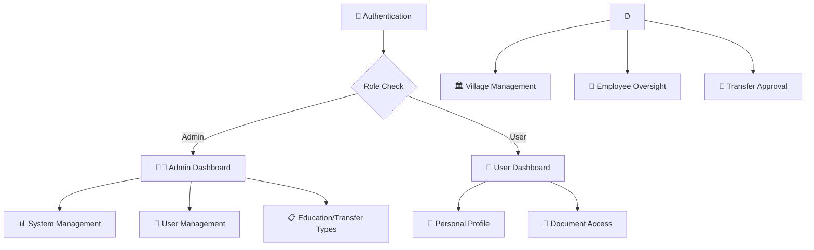

<div align="center">

# 🏢 Sistem Kepegawaian

### *Sistem Manajemen Kepegawaian Modern & Terintegrasi*

<p align="center">
  
  
  
  
</p>

<p align="center">
  
  
  
</p>

---

</div>

## 📋 Tentang Sistem

**Sistem Kepegawaian** adalah aplikasi web modern yang dirancang untuk mengelola data kepegawaian secara komprehensif dan efisien. Sistem ini menyediakan solusi terintegrasi untuk manajemen pegawai, transfer/mutasi, dan pelaporan dengan antarmuka yang intuitif dan responsif.

### ✨ Fitur Utama

<table>
<tr>
<td width="50%">

#### 👥 **Manajemen Pegawai**
- 📝 Data pegawai lengkap (PNS, PPPK, NON ASN)
- 🎓 Integrasi data pendidikan
- 📄 Upload dokumen (foto, SK)
- 📊 Status kepegawaian real-time

#### 🔄 **Sistem Transfer & Mutasi**
- 📋 Pengajuan transfer online
- ✅ Workflow persetujuan
- 📈 Tracking status transfer
- 🏛️ Manajemen antar desa/unit

</td>
<td width="50%">

#### 🏛️ **Multi-Role Management**
- 👨‍💼 **Admin**: Kontrol penuh sistem

- 👤 **User**: Akses personal dashboard

#### 📊 **Pelaporan & Analytics**
- 📈 Dashboard statistik real-time
- 📋 Laporan komprehensif
- 🔔 Sistem notifikasi
- 📱 Responsive design

</td>
</tr>
</table>

---

## 🚀 Quick Start

### 📋 Prerequisites

Pastikan sistem Anda memiliki:

```bash
🔧 PHP >= 8.2
🗄️ MySQL >= 8.0
🎼 Composer
🟢 Node.js & NPM
```

### ⚡ Instalasi

1. **Clone Repository**
   ```bash
   git clone https://github.com/hafisc/sistem-kepegawaian.git
   cd sistem-kepegawaian
   ```

2. **Install Dependencies**
   ```bash
   composer install
   
   ```

3. **Environment Setup**
   ```bash
   cp .env.example .env
   php artisan key:generate
   ```

4. **Database Configuration**
   ```env
   DB_CONNECTION=mysql
   DB_HOST=127.0.0.1
   DB_PORT=3306
   DB_DATABASE=kepegawaian
   DB_USERNAME=root
   DB_PASSWORD=
   ```

5. **Database Migration & Seeding**
   ```bash
   php artisan migrate:fresh --seed
   ```

6. **Start Development Server**
   ```bash
   php artisan serve
   ```

🎉 **Akses aplikasi di**: `http://127.0.0.1:8000`

---

## 👤 Default Accounts

| Role | Username | Password | Akses |
|------|----------|----------|-------|
| 👨‍💼 **Admin** | `admin` | `admin123` | Full system access |

| 👤 **User** | `user` | `user123` | Personal dashboard |

---

## 🏗️ Arsitektur Sistem

### 📁 Struktur Database

```
📊 Users (Pegawai)
├── 👤 Personal Info (NIP, NIK, Gender, etc.)
├── 🏢 Employment Info (Position, Rank, Type)
├── 🎓 Education Info (Level, Major, Year)
└── 📄 Documents (Photo, SK Files)

📋 Educations
├── 🎓 Education Levels (SD - S3)
└── 📝 Descriptions

🔄 Transfer Types
├── 📋 Transfer Categories
└── 🔧 Approval Requirements

🏛️ Villages
├── 📍 Location Data
└── 👥 Employee Assignments
```

### 🔐 Role-Based Access Control

<div align="center">



</div>

---

## 🛠️ Tech Stack

<div align="center">

### Backend


### Frontend


### Tools & Libraries


</div>

---

## 📸 Screenshots

<div align="center">

### 🔐 Login Page
*Modern authentication with animated background*

### 👨‍💼 Admin Dashboard
*Comprehensive system overview with real-time statistics*


### 👤 User Profile
*Personal dashboard with document management*

</div>

---

## 🤝 Contributing

Kami menyambut kontribusi dari komunitas! Berikut cara berkontribusi:

1. 🍴 **Fork** repository ini
2. 🌿 **Create** feature branch (`git checkout -b feature/AmazingFeature`)
3. 💾 **Commit** perubahan (`git commit -m 'Add some AmazingFeature'`)
4. 📤 **Push** ke branch (`git push origin feature/AmazingFeature`)
5. 🔄 **Open** Pull Request

### 📝 Development Guidelines

- 🧪 Tulis unit tests untuk fitur baru
- 📚 Update dokumentasi jika diperlukan
- 🎨 Ikuti coding standards Laravel
- 🔍 Pastikan code review passed

---

## 📞 Support & Contact

<div align="center">

### 🆘 Butuh Bantuan?

📧 **Email**: support@kepegawaian.com  
📱 **WhatsApp**: +62 xxx-xxxx-xxxx  
🌐 **Website**: https://kepegawaian.com  
📖 **Documentation**: https://docs.kepegawaian.com  

### 🐛 Bug Reports

Laporkan bug melalui [GitHub Issues](https://github.com/hafisc/sistem-kepegawaian/issues)

</div>

---

## 📄 License

Sistem ini dilisensikan di bawah [MIT License](https://opensource.org/licenses/MIT).

```
MIT License - Bebas digunakan untuk proyek komersial dan non-komersial
```

---

<div align="center">

### 🌟 Jika project ini membantu, berikan ⭐ star!

**Made with ❤️ for Indonesian Government Institutions**

---

*© 2025 Sistem Kepegawaian. All rights reserved.*

</div>
