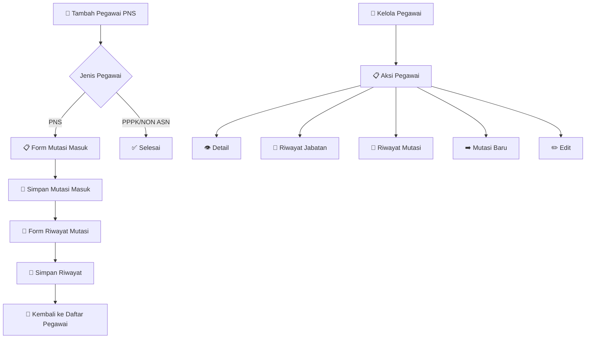

<div align="center">

# 🏢 Sistem Kepegawaian

### *Sistem Manajemen Kepegawaian Modern dengan Mutasi & Riwayat Jabatan*

<p align="center">
  
  
  
  
</p>

<p align="center">
  
  
  
</p>

---

</div>

## 📋 Tentang Sistem

**Sistem Kepegawaian** adalah aplikasi web modern yang dirancang khusus untuk mengelola data kepegawaian dengan fokus pada sistem mutasi dan riwayat jabatan. Sistem ini menyediakan solusi terintegrasi untuk manajemen pegawai PNS, PPPK, dan NON ASN dengan workflow mutasi yang komprehensif dan tracking riwayat jabatan yang detail.

### ✨ Fitur Utama

<table>
<tr>
<td width="50%">

#### 👥 **Manajemen Pegawai**
- 📝 Data pegawai lengkap (PNS, PPPK, NON ASN)
- 🎓 Integrasi data pendidikan & golongan
- 📄 Upload dokumen (foto, SK, ijazah)
- 📊 Status kepegawaian real-time
- 🔍 Filter & pencarian advanced

#### 🔄 **Sistem Mutasi Terintegrasi**
- 📋 Workflow mutasi masuk otomatis
- 📝 Riwayat mutasi komprehensif
- 🏛️ Deteksi mutasi intra/inter kecamatan
- ⚡ Auto-redirect setelah input pegawai PNS

</td>
<td width="50%">

#### 📋 **Riwayat Jabatan**
- 🏢 Tracking posisi & jabatan
- 📅 Timeline karir pegawai
- ✏️ CRUD riwayat jabatan
- 🔗 Terintegrasi dengan data pegawai

#### 📊 **Pelaporan & Notifikasi**
- 📈 Dashboard mutasi real-time
- 📋 Laporan pegawai & mutasi
- 🔔 Sistem notifikasi terintegrasi
- 📱 UI responsif modern

</td>
</tr>
</table>

---

## 🚀 Quick Start

### 📋 Prerequisites

Pastikan sistem Anda memiliki:

```bash
🔧 PHP >= 8.2
🗄️ MySQL >= 8.0
🎼 Composer
🟢 Node.js & NPM
```

### ⚡ Instalasi

1. **Clone Repository**
   ```bash
   git clone https://github.com/hafisc/sistem-kepegawaian.git
   cd sistem-kepegawaian
   ```

2. **Install Dependencies**
   ```bash
   composer install --no-dev
   npm install
   npm run build
   ```

3. **Environment Setup**
   ```bash
   cp .env.example .env
   php artisan key:generate
   ```

4. **Database Configuration**
   ```env
   DB_CONNECTION=mysql
   DB_HOST=127.0.0.1
   DB_PORT=3306
   DB_DATABASE=kepegawaian
   DB_USERNAME=root
   DB_PASSWORD=
   ```

5. **Database Migration & Seeding**
   ```bash
   php artisan migrate:fresh --seed
   ```

6. **Start Development Server**
   ```bash
   php artisan serve
   ```

🎉 **Akses aplikasi di**: `http://127.0.0.1:8000`

---

## 👤 Default Accounts

| Role | Username | Password | Akses |
|------|----------|----------|-------|
| 👨‍💼 **Admin** | `admin` | `admin123` | Full system access |
| 👤 **User** | `user` | `user123` | Personal dashboard |

---

## 🏗️ Arsitektur Sistem

### 📁 Struktur Database

```
📊 Users (Pegawai)
├── 👤 Personal Info (NIP, NIK, Gender, etc.)
├── 🏢 Employment Info (Position, Rank, Type)
├── 🎓 Education Info (Level, Major, Year)
└── 📄 Documents (Photo, SK, Ijazah Files)

📋 Transfers (Mutasi)
├── 🔄 Mutasi Masuk/Keluar
├── 📝 Riwayat Mutasi
├── 📍 Unit Asal & Tujuan
└── 📄 Dokumen Pendukung

🏢 Position Histories (Riwayat Jabatan)
├── 📋 Posisi & Jabatan
├── 📅 Periode Jabatan
├── 🏛️ Unit Kerja
└── 📝 Keterangan

📚 Master Data
├── 🎓 Educations (Tingkat Pendidikan)
├── 🏅 Grades (Golongan)
├── 👑 Ranks (Pangkat)
├── 🕌 Religions (Agama)
└── 🏛️ Villages (Desa/Unit)
```

### 🔄 Workflow Mutasi

<div align="center">



</div>

---

## 🛠️ Tech Stack

<div align="center">

### Backend


### Frontend


### Tools & Libraries


</div>

---

## 📸 Screenshots

<div align="center">

### 🔐 Login Page
*Modern authentication dengan role-based access*

### 👨‍💼 Admin Dashboard
*Dashboard komprehensif dengan statistik mutasi real-time*

### 👥 Manajemen Pegawai
*Interface lengkap dengan aksi mutasi dan riwayat jabatan*

### 🔄 Workflow Mutasi
*Sistem mutasi terintegrasi dengan auto-redirect*

### 📋 Riwayat Jabatan
*Tracking karir pegawai dengan timeline lengkap*

</div>

---

## 🤝 Contributing

Kami menyambut kontribusi dari komunitas! Berikut cara berkontribusi:

1. 🍴 **Fork** repository ini
2. 🌿 **Create** feature branch (`git checkout -b feature/AmazingFeature`)
3. 💾 **Commit** perubahan (`git commit -m 'Add some AmazingFeature'`)
4. 📤 **Push** ke branch (`git push origin feature/AmazingFeature`)
5. 🔄 **Open** Pull Request

### 📝 Development Guidelines

- 🧪 Test fitur mutasi dan riwayat jabatan
- 📚 Update dokumentasi untuk workflow baru
- 🎨 Ikuti coding standards Laravel
- 🔍 Pastikan validasi form mutasi
- 🔄 Test auto-redirect setelah input PNS

---

## 📞 Support & Contact

<div align="center">

### 🆘 Butuh Bantuan?

📧 **Email**: hafisc@kepegawaian.com  
📱 **GitHub**: https://github.com/hafisc  
🌐 **Repository**: https://github.com/hafisc/sistem-kepegawaian  
📖 **Issues**: https://github.com/hafisc/sistem-kepegawaian/issues  

### 🐛 Bug Reports

Laporkan bug melalui [GitHub Issues](https://github.com/hafisc/sistem-kepegawaian/issues)

</div>

---

## 📄 License

Sistem ini dilisensikan di bawah [MIT License](https://opensource.org/licenses/MIT).

```
MIT License - Bebas digunakan untuk proyek komersial dan non-komersial
```

---

<div align="center">

### 🌟 Jika project ini membantu, berikan ⭐ star!

**Made with ❤️ for Modern Employee Management**

### 🚀 Fitur Terbaru v2.0
- ✅ Sistem mutasi terintegrasi
- ✅ Riwayat jabatan komprehensif  
- ✅ Auto-redirect workflow PNS
- ✅ Upload dokumen multi-format
- ✅ Filter dan pencarian advanced
- ✅ UI/UX responsif modern

---

*© 2025 Sistem Kepegawaian v2.0. All rights reserved.*

</div>
